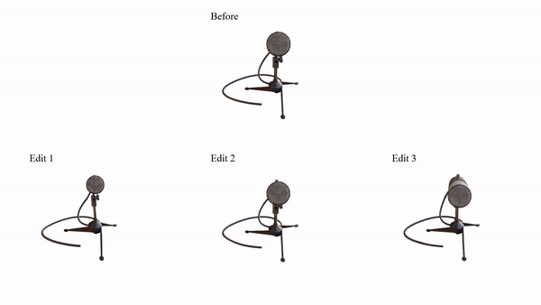

# Interactive Geometry Editing of Neural Radiance Fields [[Arxiv Paper](https://arxiv.org/abs/2303.11537)]
Code for our paper:
> **Interactive Geometry Editing of Neural Radiance Fields**
> <br>Shaoxu Li, Ye Pan<br>





## Comments

- Our codebase is based on the [nerf](https://github.com/bmild/nerf) implemented by [nerf-pytorch](https://github.com/yenchenlin/nerf-pytorch).
## BibTeX

```
@misc{li2023interactive,
      title={Interactive Geometry Editing of Neural Radiance Fields}, 
      author={Shaoxu Li and Ye Pan},
      year={2023},
      eprint={2303.11537},
      archivePrefix={arXiv},
      primaryClass={cs.CV}
}
```
## Related Work

```
@inproceedings{mildenhall2020nerf,
  title={NeRF: Representing Scenes as Neural Radiance Fields for View Synthesis},
  author={Ben Mildenhall and Pratul P. Srinivasan and Matthew Tancik and Jonathan T. Barron and Ravi Ramamoorthi and Ren Ng},
  year={2020},
  booktitle={ECCV},
}
@misc{lin2020nerfpytorch,
  title={NeRF-pytorch},
  author={Yen-Chen, Lin},
  publisher = {GitHub},
  journal = {GitHub repository},
  howpublished={\url{https://github.com/yenchenlin/nerf-pytorch/}},
  year={2020}
}
```
